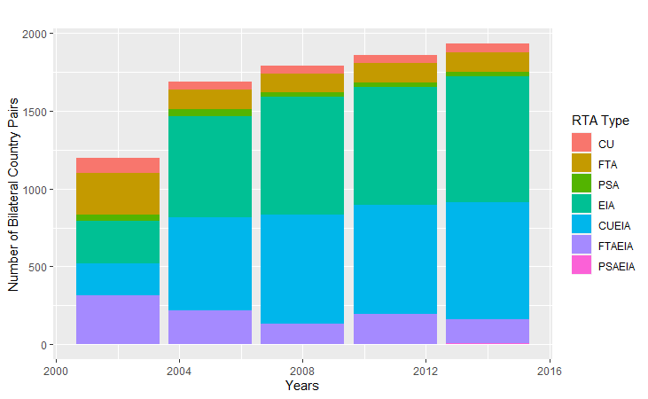

<!-- ```{css, echo=FALSE} -->

<!-- h1, h2, h3 { -->

<!--   text-align: center; -->

<!-- } -->

<!-- ``` -->

---

\let\cleardoublepage\clearpage

```{r setup, include=FALSE}
knitr::opts_chunk$set(echo = FALSE)
```

```{r setwd, include=FALSE}
setwd = "C:/Users/gerod/Desktop/EGEI Master/Trade Policy Analysis/Vurchio/Assignment/Report/paper"
```


__Abstract.__ We study the trade effects of different trade agreement regimes by adopting a set of seven trade agreement regime dummies. Instead of only targeting gross bilateral trade flows (GTRADE), we add another measure for trade flows: trade in domestic value added (DVA), to capture countries’ increasing participation in global value chains. Based on the icio STATA command, we extract gross bilateral trade flows and trade flows in DVA for 43 countries from 2002 to 2014, with an interval of three years. In general, we find significant and positive trade effects of Custom Unions (CU), Free Trade Agreements (FTA), and Economic Integration Agreements (EIA) for both measures and that the absolute magnitude of effects is larger for GTRADE as compared to DVA.  


 
 
# Introduction

Over the last decades, the speed of global economic interlinkages has been increasing as fastly as 
never before. The increase of regional trade agreements (RTAs) notified to the WTO from 28 in 1990 to 355 in 2021, as well as the resulting increase in global trade volume from  welfare gains from trade document this trend. While the gross global export value has increased fourfold, a growth rate of around 100% over the same time, the ratio of goods trade over GDP has not seen such large increase. Is trade making us poorer?

Recently, a debate on trade liberalization, global value chains and implications for national welfare has emerged. It has been stimulated by breakthrough methods of decomposing aggregate trade into subcategories. One of these subcategories is domestic value added (DVA). The DVA measure captures the value in total exports of a country which are generated purely domestically. Adopting the icio command in STATA, which closely links statistical software to the data, we make use of the recent advances to answer the following empirical question: is the effect of trade liberalization policies stronger on gross exports than on domestic value added in gross exports?

Section 2 gives an overview of the literature on the effects of trade liberalization on trade flows, introducing the reader to a canon of empirical findings to which our study adds novel insights. Section 3 introduces the data we use to answer our research question. To the extent to which our explanatory variables contain heterogeneity, we dig deeper into the question of which countries they cover. Section 4 examines our model specifications, including the estimation challenges which we intend to tackle. Section 5 presents our results. Following a discussion of our findings in Section 6, we conclude our study in Section 6. 


# Literature Review

The complexity of RTAs has been deeply analyzed in the literature, with a great focus on the trade creation and trade diversion aspects. @baier2007free offer an in-depth analysis of the effects of FTAs on trade flows, showing that, on average, an FTA doubles two members’ bilateral trade after 10 years. In more complex agreements, however, not all member countries equally benefit from the increase in trade, both because of their size and the sectors in which they specialize (@felbermayr2018schengen). @felbermayr2022quantifying show that the implementation of Brexit has had significant negative consequences on small EU27 countries. Some of the latter present even higher welfare losses than the UK itself. Generally speaking, dismantling well-consolidated trade agreements negatively influences member countries’ welfare, whilst the effects are vastly heterogeneous (@felbermayr2022complex). 

In a similar vein, @mayer2019cost estimate trade creation deriving from the EU by creating counterfactuals in which the level of integration is lower or totally absent. They predict that, on average, the costs of non-Europe (weighted by country size) vary between 3.8% and 5.5%, depending on the considered counterfactual. Similar results have been obtained by @baier2019putting, who study the economic impact of the elimination of the North American FTA (NAFTA) for the member countries. It appears that Canada is the member with most negative consequences.

What the studies mentioned above however do not look at is the question if reshoring which follows economic disintegration is linked to increased domestic value added. If trade was drawing value added away to other shores, would Brexit imply that Britain's domestic industry won economic power? Would Canada gain a higher share of domestic value added if NAFTA was dismantled? To answer such questions, we must acknowledge that apart from looking at only gross trade, a more comprehensive way to measure the impact of trade agreements is to investigate the variation in countries’ domestic value added (DVA) linked to trade agreements. 

In our era coined by the growing complexity of global value chains (GVCs), a relevant issue in international trade becomes the proper accounting of trade flows (see the survey of @antras2021global). As @aslam2017calculating state, the currently used production fragmentation implies that intermediate goods cross borders several times along the chain, often passing through many countries more than once. Consequently, the commonly adopted trade statistics of gross trade flows may not be accurate and call for a change in the used method. Significant developments on this frontier have been triggered by @koopman2014tracing. Providing a rich decomposition of gross trade, @koopman2014tracing lay the ground for studies which seek to exploit a deeper disaggregation of the value added generated by trade by including all measures of vertical specialization and value-added trade in the literature, adjusting for the trade of intermediates across multiple borders. The aim of our contribution is to provide a comparison between of the effects of trade liberalization on gross exports and domestic value added (DVA), one of the key measures @koopman2014tracing propose. For a schematic intuition, please see Figure 7.2 in our Appendix.


# Data

We restrict our analysis to a time frame consisting of twelve years (2002-2014). Extracting data on 
gross exports and DVA in 3-year-intervals, we regress both trade measures on our set of explanatory variables. We obtain ample heterogeneity on trade liberalization during our period of interest from
the RTA database. Lastly, we employ a set of additional controls used frequently in gravity analyses of trade flows.

## Gross Exports and Domestic Value Added (DVA)

We rely on @belotti2020icio who introduce the icio STATA command.
This command computes the most relevant measures of trade in value-added of countries and sectors by 
exploiting Inter-Country Input-Output (ICIO) tables. Their approach rests on the feature that 
the measures of value-added trade are additive at any level of aggregation of trade flows 
(@borin2019measuring). We opt for "wiodn", which gives out data for 44 countries, including the rest of the world ("ROW")
from the WIOD 2016 release (@timmer2015illustrated). 
Running the STATA commands, we obtain __gross exports__ as well as a __DVA__ component on a bilateral country-pair level for five three-year intervals between 2002 and 2014. As we do not have policy dummies for the "ROW", we decide to drop it. Please find a map with the countries included in Figure 7.1 of our Appendix. 
 
## Trade Policy Dummies 

We opt for country-level data on various RTA variables from Mario Larch's 
RTA Database (@egger2008interdependent). The database contains all 
multilateral and bilateral regional trade agreements as notified to the WTO from 1950 to 2019.

We first collect data on CU, FTA and PSA as policy variables. When running the regressions with the data on 
gross exports and DVA, we find that coefficients for 
this set of policy dummies are not significant and partly negative. 
Hence, we decide to extend our analysis to the full set of seven dummies (CU, FTA, PSA, EIA, CUEIA, FTAEIA and PSAEIA).

The stacked bars in Figure 3.1 present all bilateral trade policy ties over time, grouped by the seven dummy variables we use. 

```{r graph, echo=FALSE, out.width="90%", fig.align="center", fig.cap="Trade liberalisation dummy variables for the WIOD countries (2002-2014). Data source: RTA Database by Egger and Larch (2008)."}

```


The evolution shows that there is substantial increase in EIA and CUEIA between 2002 and 2005. Interested in knowing more about the exact country-pair relationships behind these dummies, we consult the official WTO RTA database 
(http://rtais.wto.org/UI/PublicAllRTAList.aspx), which Mario Larch also uses as the source of his 
RTA database (see "Readme.pdf" file of @egger2008interdependent). Figure 3.2 shows the variation in trade liberalization policies we exploit over countries and time. The table intends to link the coefficients reported in our results to specific episodes of trade liberalization policies. 
For example, we see that the CU contains customs union agreements
between the EU and accession candidates as well as the EU-Türkiye CU (1995). FTA contains minor important bilateral economic agreements. However, the CUEIA dummy captures the EU. NAFTA, for instance, along with many other trade agreements for the set of WIOD countries is counted in the FTAEIA dummy. Looking at the bilateral country pairs behind the EIA dummy, we see that much of the increase in the bars between 2002 and 2005 comes from the EU accession countries in 2004 (see Figure 3.1).


```{r rta, echo=FALSE, out.width="90%", fig.align="center", fig.cap="Variation across different trade policies as in the RTA dataset by Egger and Larch (2008) we use. We retrieve information on the involvement of the WIOD countries in bilateral trade agreements (2002-2014) from http://rtais.wto.org/UI/PublicAllRTAList.aspx."}
knitr::include_graphics("data_rta.png")
```

## Control variables

We include a set of standard gravity variables as controls for potentially 
endogenous drivers of bilateral trade flows from the CEPII Gravity database 
(@conte2022cepii). 

# Specifications

In outlining our specifications, we follow the
“Challenges and solutions for estimating structural gravity models” 
as presented in @yotov2016advanced p. 18 ff.

Figure 4.1 presents the challenges when estimating our structural gravity models 
together with the econometric techniques we apply to tackle them.


```{r estimation, echo=FALSE, out.width="90%", fig.align="center", fig.cap="Estimation challenges of structural gravity models as in Yotov et al. (2016) p. 18 ff. tackled by our model specifications."}
knitr::include_graphics("model_estimation.png")
```

__Challenge 1: Multilateral resistances (MRs)__

In our first three specifications we capture outward MRs and inward MRs by 
creating exporter-time and importer-time fixed effects (FEs). In our last 
specification (iv), we use fixed effects for each exporter, importer and year, separately.

We interpret the FEs as absorbers of average trade 
barriers (@anderson2003gravity)
relative to which the effect of bilateral trade barriers should be evaluated. 
By definition, both FEs absorb, respectively, the exporter value of output and 
importer expenditure, as well as all other observable and unobservable exporter- 
and importer-specific characteristics that may influence bilateral trade 
(@yotov2016advanced).

__Challenge 3: Heteroskedasticity of trade data__

Heteroskedasticity of trade data implies biased and inconsistent estimates when 
adopting OLS. We tackle heteroskedasticity with the use of the Poisson Pseudo 
Maximum Likelihood (PPML) estimator, following @silva2006log in our 
specifications (ii), (iii), and (iv).

__Challenges 4 and 5: Bilateral trade costs and Endogeneity of trade policy__

One of the biggest challenges in obtaining reliable estimates of the effects of 
trade policy within the gravity model is that trade policy variables 
and trade cost components are 
endogenous, because it is possible that trade policy may be correlated with 
unobservable cross-sectional trade costs. We are interested in the neat separation of the effect of the seven different trade liberalization policies. To proxy for sources of implicit bilateral trade costs appearing in the structural gravity specifications (i), (ii), and (iii), we explot four dummies from the GRAVITY database by CEPII compiled by @conte2022cepii. Our choice falls on the _Distance_ (ln_dist) _Contiguity_ (contig) _Language_ (comlang_off) dummies as well as the _Colony_ (col45) dummy. 

In specification (iv) we tackle the challenges by accounting 
for any unobservable time invariant trade cost components with exporter-time, 
importer-time and country-pair fixed effects. 
@egger2015structural and @agnosteva2014intra show that the pair-fixed effects 
are a better measure of bilateral trade costs than the standard set of gravity 
variables.

__Challenge 6: Non-discriminatory trade policy__

We are aware that we perform our analysis for a world which is, despite the surge
in RTAs (see Figure 3.1) is still heavily influenced by WTO-style 
non-discriminatory unilateral trade policy such as most-favoured-nation (MFN) 
tariffs. The issue with non-discriminatory trade policy covariates is that they are 
exporter- and/or importer-specific, and therefore they will be absorbed, 
respectively, by the exporter-time and by the importer-time fixed effects 
(@yotov2016advanced). @heid2021estimating propose including intra-national trade 
flows, capitalizing on the fact that while non-discriminatory trade 
policies are country-specific, they do not apply to intra-national trade. 

In our specification (iii), we include intra-national export data to our 
gravity estimations. Hence, we account for not only trade between Australia and 
partner countries, but also for trade within Australia. An additional merit of the 
intra-trade dummy is to control for a home bias between inter- vs intra-national trade (@borchert2017distance).

__Challenge 7: Adjustment to trade policy changes__

Adjustment of trade flows in response to trade policy changes are not instantaneous. 
This might threaten the validity of our estimations if pooled over consecutive years 
(@trefler2004long and @egger2020gravity). 

In order to account for the potential lags in the effectiveness of the 
trade policies, we measure trade flows between 2002 and 2014 in five 
three-year intervals in all specifications. 


__Challenge 8: Gravity with disaggregated data__

Many trade policies are negotiated and applied at the sectoral level, such as 
tariffs. Hence, results can be driven or distorted by only a few sectors. 
For the sake of detailed and insightful results, it is desirable to perform 
analyses of trade liberalization policies at a highly disaggregated level. 

Due to the long running time of the code, we chose not to take sectoral data 
into account. This adds a potential limitation to our study.

## Benchmark Gravity Estimation with OLS

## Gravity Estimation with PPML

Using STATA, we estimate both __specifications (i) and (ii)__ with

__(1) and (3)__ GTRADE as the dependent variable

\begin{center}
\begin{math}
\begin{aligned}
X_t^{ij} = \alpha + GTRADE_t^{ij} + \beta GRAVITY^{i} + \gamma_1CU + 
\gamma_2FTA + \gamma_3PSA + \\ \gamma_4EIA + \gamma_5CUEIA + \gamma_6FTAEIA + 
\gamma_7PSAEIA + \\ \mu_t^i + \eta_t^j + \epsilon_t^{ij}
\end{aligned}
\end{math}
\end{center}

and

__(2) and (4)__ DVA as the dependent variable

\begin{center}
\begin{math}
\begin{aligned}
X_t^{ij} = \alpha + DVA_t^{ij} + \beta GRAVITY^{i} + \gamma_1CU + 
\gamma_2FTA + \gamma_3PSA + \\ \gamma_4EIA + \gamma_5CUEIA + \gamma_6FTAEIA + 
\gamma_7PSAEIA + \\ \mu_t^i + \eta_t^j + \epsilon_t^{ij}
\end{aligned}
\end{math}
\end{center}

where 

- $GRAVITY^{i}$ captures additional potential drivers behind the effects of the 
dependent variable along with the explanatory variables, namely:

  - $Distance^{ij}$: the bilateral distance between countries i and j 
  (originally named ln_dist)
  
  - $Contiguity^{ij}$: an indicator variable that takes the value 1 if country i 
  and country j share a common border (originally named contig)
  
  - $Language^{ij}$: an indicator variable that takes the value 1 if country i 
  and country j share a common language (originally named comlang_off) andj
  
  - $Colony^{ij}$: an indicator variable that takes the value 1 if country i 
  and country j had a colonial relationship in 1945 (originally named col45)

- $\mu_t^{i}$ is the exporter-time fixed effect, $\eta_t^j$ is the importer-time 
fixed effect and $\epsilon_t^{ij}$ expresses the error term.


## Intra-National Trade Dummy

Using STATA, we estimate __specification (iii)__ with

__(5)__ GTRADE as the dependent variable

\begin{center}
\begin{math}
\begin{aligned}
X_t^{ij} = \alpha + GTRADE_t^{ij} + \beta GRAVITY^{i} +  \gamma_1CU + 
\gamma_2FTA + \gamma_3PSA + \\ \gamma_4EIA + \gamma_5CUEIA + \gamma_6FTAEIA + 
\gamma_7PSAEIA + \\ \delta INTRA  \mu_t^{i} + \eta_t^j + \epsilon_t^{ij}
\end{aligned}
\end{math}
\end{center}

and

__(6)__ DVA as the dependent variable

\begin{center}
\begin{math}
\begin{aligned}
X_{t}^{ij} = \alpha + DVA_t^{ij} + \beta GRAVITY^{i} +  \gamma_1CU + 
\gamma_2FTA + \gamma_3PSA + \\ \gamma_4EIA + \gamma_5CUEIA + \gamma_6FTAEIA + 
\gamma_7PSAEIA + \\  \delta INTRA  \mu_t^{i} + \eta_t^j + \epsilon_t^{ij}
\end{aligned}
\end{math}
\end{center}

Using the absorb command in STATA, we generate exporter-year, importer-year, 
and symmetric exporter-importer fixed effects. The INTRA-dummy captures all 
relevant forces that discriminate between inter- and intra-national trade.

## Country-Pair Fixed Effects Estimation

Using STATA, we estimate __specification (iv)__ with

__(7)__ GTRADE as the dependent variable

\begin{center}
\begin{math}
\begin{aligned}
X_{t}^{ij} = \alpha + GTRADE_t^{ij} + \gamma_1CU + \gamma_2FTA + \gamma_3PSA + \\
\gamma_4EIA + \gamma_5CUEIA + \gamma_6FTAEIA + \gamma_7PSAEIA + \\ \delta INTRA  + 
\sigma_t^i + \theta_t^j + \psi^{ij} + \epsilon_t^{ij}
\end{aligned}
\end{math}
\end{center}

and 

__(8)__ DVA as the dependent variable

\begin{center}
\begin{math}
\begin{aligned}
X_{t}^{ij} = \alpha + DVA_t^{ij} + \gamma_1CU + \gamma_2FTA + \gamma_3PSA + \\
\gamma_4EIA + \gamma_5CUEIA + \gamma_6FTAEIA + \gamma_7PSAEIA + \\ \delta INTRA  + 
\sigma_t^i + \theta_t^j + \psi^{ij} + \epsilon_t^{ij}
\end{aligned}
\end{math}
\end{center}

where $\sigma_t^i$ is the exporter-time fixed-effect, $\theta_t^{j}$ is the 
importer-time fixed-effect and $\psi^{ij}$ is the exporter-importer fixed 
effect.


# Results

```{r results, echo=FALSE, out.width="90%", fig.align="center", fig.cap="The estimated results."}
knitr::include_graphics("results.png")
```

__Columns (1) and (2)__ of Figure 5.1 above report the estimated results for the __baseline gravity equation (i) by OLS__. 

CU, FTA, EIA, CUEIA, and FTAEIA have significantly positive effects on bilateral 
trade flows, both measured by gross trade flows (GTRADE) and DVA. 

For example, all else equal, CU membership increases bilateral gross trade by 7.3 
billion US dollars and DVA by 6 billion US dollars. Surprisingly, PSA has 
significantly negative effects while we find no significant effects of PSAEIA. 

Comparing the results for GTRADE and DVA, the former has a larger absolute 
magnitude in all coefficient estimates, suggesting the trade agreement variables 
have larger effects on GTRADE than DVA.  
 
__Columns (3) and (4)__ report the estimated results for the __baseline gravity equation (ii) by PPML__, 
where we find significantly positive effects of 
CU, FTA, and EIA. For example, all else equal, being in a CU increases gross 
bilateral trade between the two countries by 111.2% $[exp(0.748) − 1] × 100]$ 
and DVA by 103.8% $[exp(0.712) − 1] × 100]$. But CUEIA and FTAEIA lose 
significance. PSAEIA has significantly negative effects. Similar to columns (1) 
and (2), the absolute magnitude of effects is larger on GTRADE than DVA. 
 
__Columns (5) and (6)__ report the estimated results for the __gravity equation (iii) controlling for intra-national trade by PPML__. 
The results are similar to those estimated for equation (1), besides some slight 
decrease in absolute magnitude. 

From columns (1) to (6), the estimated coefficients of the two control variables 
(distance, and border contiguity) have signs consistent with expectations and 
traditional gravity model literature. We find almost no significant effect of 
common language and inconsistent estimates of a colonial relationship. 

Finally, __columns (7) and (8)__ report the estimated results for the __gravity equation (iv) controlling for endogeneity by PPML__, 
where we find no significant results at all. 


# Discussion

## Trade liberalization and aggregate trade flows

We first mirror our results on GTRADE against studies on the effects of trade liberalization which are in a most similar vein.

Similar to @mayer2019cost, our PPML yields smaller estimates of the trade gains associated with the EU (EIA dummy) than OLS. For the 2002-2014 period, our PPML estimate suggests a smaller 51% increase $([exp(0.554)-1]*100)$. Using data from IMF DOTS from 1950 to 2012, their preferred estimate of the EU effects state that the single market version of the EU triples trade. In terms of methodology and data, @felbermayr2018schengen is similar to our study. Using the PPML estimator and WIOD trade flows for 40 countries from 1995 to 2011, they find that mutual EU membership increases bilateral exports by 122.6% (53.2% for the CU and 69.4% for the Single Market). Other RTAs established after 1995 boost goods trade by an additional 35.3%. Our estimate of 51% being smaller than theirs suggests that EU integration following the creation of the WTO in 1995 has been strong, as well.

Indeed, economic integration in the EU has been very strong since the 1990s. The European Single Market was already established in 1993, the Schengen Agreement that ended formal border controls between many European countries has entered into force in 1995, the Eurozone has been created in 1999 and in 2002, the Euro was adopted as a currency in many EIA countries. Furthermore, in the period of study, the EU extended to 28 countries: the Czech Republic, Cyprus, Estonia, Hungary, Latvia, Lithuania, Malta, Poland, Slovakia, and Slovenia joined the EIA in 2004, followed by Bulgaria and Romania (2007) and Croatia (2013).

Viewing our results on GTRADE in perspective with the trade agreement literature, we can state that for a subset of countries (WIOD) and our limited time frame (2002-2014), our results on GTRADE are plausible in magnitude for various dummies. 

## Trade liberalization and domestic value added (DVA)

@antras2021global reckon that the literature on the desirability and effects of trade policy in a world of GVCs is still in its infancy. Our study can add to the debate on levels of DVA in the context of trade liberalisation, as well as provide evidence which might be provocative enough to stimulate a broader debate on GVC integration and a country's trade policy among researchers and policymakers. 

First, we compare our results to a finding in the more standard quantitative trade literature. In their general equilibrium counterfactual analysis, based on the baseline year of 2014, @felbermayr2022complex back out counterfactual gross exports and VAX ratios in case of a dismantling of the EU-KOR and EU-MEX FTAs (part of our FTAEIA dummy). Their Table 2 shows that such scenario would have less exports to the EU from non-EU countries as a consequence. VAX-ratios would increase, suggesting that the reshoring might entail a higher relative share of domestic value added for the splitting parties. Our results for the FTAEIA DVA in columns (4), (6) and (8) however are not significant. We conclude that we shall take the EU as another example.

Next, we look at the EU. To our question, it would be interesting to know whether there is a different effect of trade policies on DVA on either EU-15 or CEE-10 countries. As they capture heterogeneity between old EU and new EU countries before accession (CU), among new EU countries (FTA) and between old and new EU countries (EIA), our specifications shed light on this question. Drawing on the WIOD as well, @vrh2018drives documents a gradual decline of DVA in both old EU-15 and new 2004 accession countries (CEE-10) between 1995–2011. Our columns (4) and (6) confirm that the effect is strongest for CU, followed by EIA and then FTA. To the extent that the CEE-10 countries dominate the CU dummy, the decline in DVA for CEE-10 countries over time is reflected in our data, as well. As an explanation for the lower DVA of CEE-10 as compared to EU-15, @vrh2018drives claims that progress in GVC upgrading comes from a larger stock of knowledge-based capital and more sophisticated exports. 

Against the backdrop of globalization it makes sense that our positive coefficients of GTRADE reflect positive trade effects due to economic integration. Also the finding that (with one exception, DVA in specification (ii) for the EU), the _GTRADE > DVA_ results make sense. But it is questionable whether trade that involves the outsourcing of domestic production activities leads to welfare gains once the effect creates a gap between gross exports and domestic value added. A necessary condition for welfare gains to materialize would be that _net trade creation_ - _loss in DVA_ > 0. Such net trade creation would only hold if foreign countries could produce former DVA more efficiently.

There is much evidence for net trade creation. In a monopolistic framework, one potential channel of efficiency gains from trade liberalization could be that the de-fragmentation (market integration) leads to pro-competitive effects through reductions in mark-ups, which lead to industrial restructuring (e.g. M&A) and the exit of firms. The reallocation to more efficient firms would provide them a larger market share and translate into an increase in aggregate efficiency. Analyzing three major industry groups and 18 detailed industries in ten EU member states between 1981-1999, @badinger2007has finds evidence for reductions in mark-ups for aggregate manufacturing and construction. In 1994, around introduction of the EU Single Market programme, markups go down significantly. 

This discussion shows that there remains still much to explore in the field of trade policy and its effect on subcomponents of gross exports such as DVA. Also interesting to assess could be growth effects of GTRADE vs. DVA. 


# Conclusion

In this paper, we study the trade effects of different trade agreement regimes 
by adopting a set of seven trade agreement regime dummies, which are CU, FTA, PSA, 
EIA, CUEIA, FTAEIA, and PSAEIA.

Instead of only targeting gross bilateral trade flows (GTRADE), we add another 
measure for trade flows: trade in domestic value added (DVA). Against the background of the international diffusion of production networks and countries’ increasing participation in GVCs over the past decades, this is a fairly interesting endeavour.

Based on the icio STATA command, we extract gross bilateral trade flows and the DVA component of 
gross trade for 43 countries from 2002 to 2014, with an interval of three years. 
By and large, we find significant and positive trade effects of Custom Unions (CU), 
Free Trade Agreements (FTA), and Economic Integration Agreements (EIA) and that, with one 
exception, the absolute magnitude of effects is larger for GTRADE compared to DVA. Our results suggest we might need stronger evidence to evaluate the effects of trade agreements, more precisely. Overall, the inconsistency and instability of estimates is expected given our limited data coverage, 
as we only include five periods and 43 countries. 

Having found smaller effects of various trade liberalization episodes on DVA than on GTRADE, our study joins the debate on trade creation versus trade diversion in the context of DVA as an additional important GVC measure. We reckon that a controversial and policy-relevant question in this context to be whether the higher volume in a country's gross exports relative to DVA as a consequence of trade liberalization is linked to welfare gains.


<div id="refs"></div>

# Appendix {-} 

```{r map, echo=FALSE, out.width="90%", fig.align="center", fig.cap="A world map showing the 43 countries of the WIOD 2016 we analyze."}
knitr::include_graphics("Map.png")
```

```{r decomposition, echo=FALSE, out.width="90%", fig.align="center", fig.cap="The disaggregation of gross exports according to Koopman et al. (2014) which Borin and Mancini (2019) use."}
knitr::include_graphics("decomposition.png")
```

